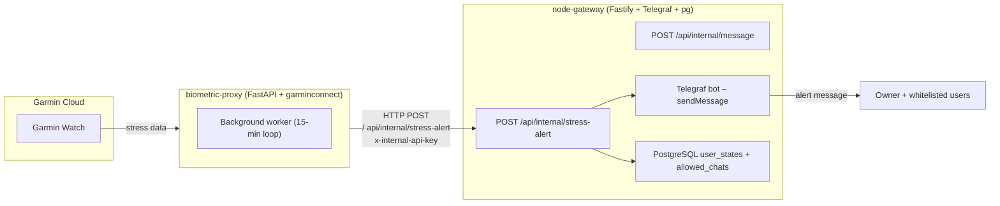
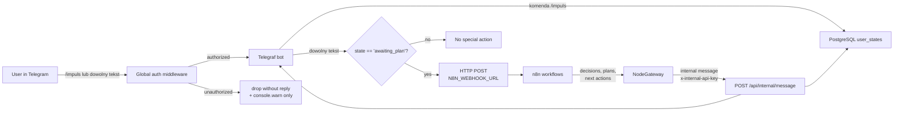

### AI-driven Automation Gateway – Architecture

System składa się z kilku współpracujących usług kontenerowych:

- `biometric-proxy` – proxy biometrów (Garmin → internal API).
- `node-gateway` – brama decyzyjna / zewnętrzna kora przedczołowa (Telegram, state machine, n8n).
- `postgres` – trwałe przechowywanie stanów użytkownika.
- `n8n` – silnik workflowów i orkiestracji automatyzacji.

---

### Dane z biometrów: Garmin → Python → Node → Telegram

---

### Dane z chatu: Telegram → Node → DB → n8n (z ACL owner + whitelist)

---

### Przepływ stanów użytkownika

- Default state: `default` – brak aktywnego procesu decyzyjnego.
- Po komendzie `/impuls`:
  - Node Gateway wysyła stoicką odpowiedź o odczekaniu 120 sekund.
  - Stan użytkownika w tabeli `user_states` zmienia się na `cooling_down_120s`.
- Gdy n8n wyśle impuls „stwórz plan”:
  - Node Gateway ustawia stan `awaiting_plan`.
  - Kolejna wiadomość tekstowa użytkownika:
    - jest forwardowana do `N8N_WEBHOOK_URL`,
    - stan resetowany jest do `default`.

---

### Security & ACL model (owner + whitelist)

- **Owner (`MASTER_CHAT_ID`)**:
  - zawsze przechodzi przez globalny middleware (niezależnie od whitelisty),
  - może wykonywać komendy admina:
    - `/allow_here` – dodaje bieżący chat do tabeli `allowed_chats`,
    - `/revoke_here` – usuwa bieżący chat z `allowed_chats`,
    - `/allowed_list` – wypisuje aktualną whitelistę.
- **Whitelist (`allowed_chats`)**:
  - przechowywana w tej samej bazie PostgreSQL co `user_states`,
  - każdy wpis to `chat_id BIGINT PRIMARY KEY` + `created_at TIMESTAMP`.
- **Globalny middleware Telegrafa**:
  - odczytuje `from.id` oraz `chat.id` z aktualizacji,
  - jeśli brak identyfikatorów → odrzuca aktualizację,
  - jeśli `from.id === MASTER_CHAT_ID` → przepuszcza do dalszych handlerów,
  - w przeciwnym razie sprawdza, czy `chat.id` istnieje w `allowed_chats`:
    - jeśli nie → loguje ostrzeżenie (`console.warn`) i kończy pipeline bez odpowiedzi do użytkownika,
    - jeśli tak → przepuszcza dalej.
- **Stress alerts**:
  - `biometric-proxy` wysyła zdarzenie na `POST /api/internal/stress-alert` z nagłówkiem `x-internal-api-key` i `stressValue`,
  - `node-gateway`:
    - buduje listę odbiorców: `MASTER_CHAT_ID` + wszystkie wpisy z `allowed_chats`,
    - wysyła alert do każdego odbiorcy,
    - ustawia stan `awaiting_plan` w `user_states` dla każdego odbiorcy.

